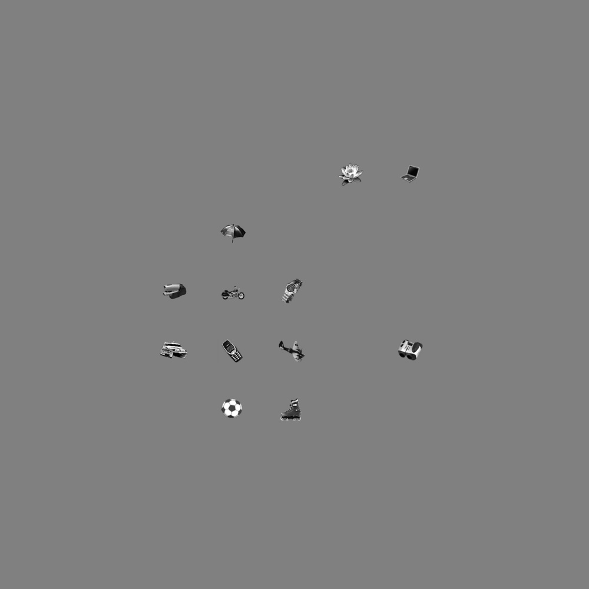
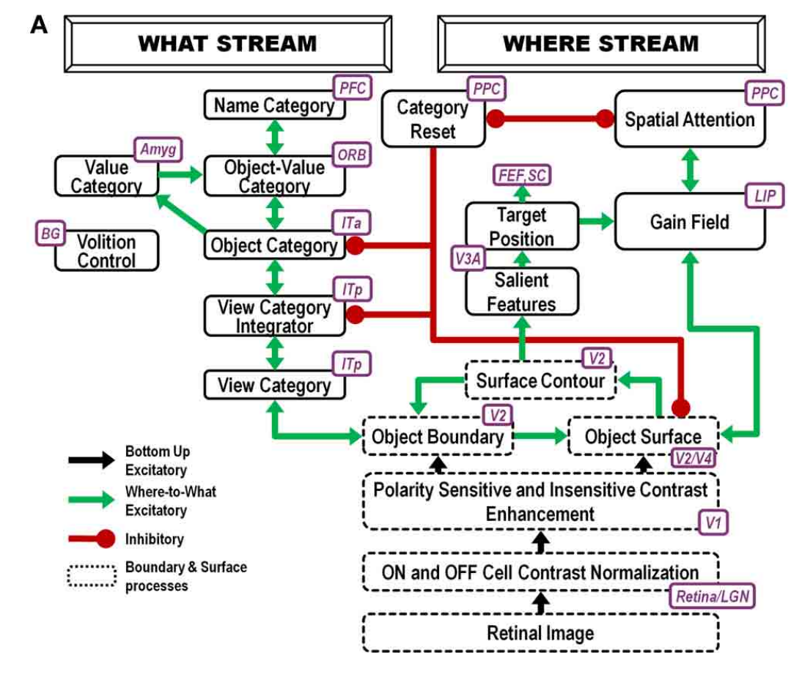

# ARTSCAN

论文：Where’s Waldo? How perceptual, cognitive, and emotional brain processes cooperate during learning to categorize and find desired objects in a cluttered scene

## 数据生成

1. 根据data_generation.py生成，给出的部分数据在img中。
2. 文件夹中存放超过25张图片时，只会生成25个物体的图片，少于25个物体时位置随机合成。
3. 每个物体大小会被resize到50*50大小，可根据实际情况调整自行修改。
4. 图片大小固定为500*500，会pad到1000*1000。pad的像素值为[128,128,128]灰色
5. 随机生成的图片如下图“output_pad.jpg”所示。


``` css
python3 data_generation.py
```

## 流程图



## arcscan.py
